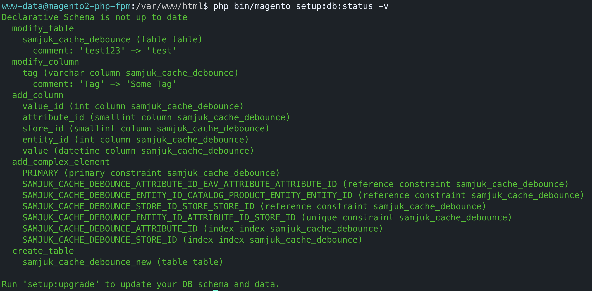
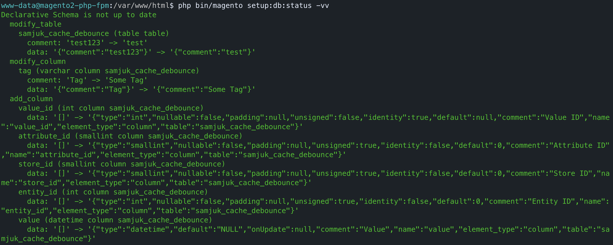

# SamJUK_VerboseDBStatus

[](https://github.com/SamJUK/m2-module-verbose-db-status/actions/workflows/ci.yml) [](https://github.com/SamJUK/m2-module-verbose-db-status/releases)

This is a simple module that adds a verbose and extra verbose mode to the `setup:db:status` command. 

Especially useful within a CI environment for identifying what schema changes are causing a database migration, which in turn prevents most typical zero downtime deployment strategies.

Example with the verbose flag set | Example with the extra verbose flag set
--- | ---
 | 

---

## Installation

```bash
composer config repositories.samjuk-m2-module-verbose-db-status vcs git@github.com:SamJUK/m2-module-verbose-db-status.git
composer require samjuk/m2-module-verbose-db-status:@dev
php bin/magento module:enable SamJUK_VerboseDBStatus && php bin/magento cache:flush
```

---

## Usage

Run the `setup:db:status` command, specifying the appropriate verbosity level
```bash
php bin/magento setup:db:status # Standard Magento Output
php bin/magento setup:db:status -v # Display before and after for modified values
php bin/magento setup:db:status -vv # Display before and after for modified values, and raw data diff
```